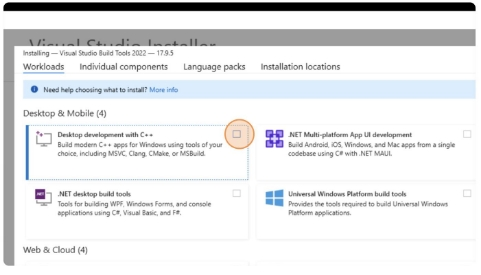
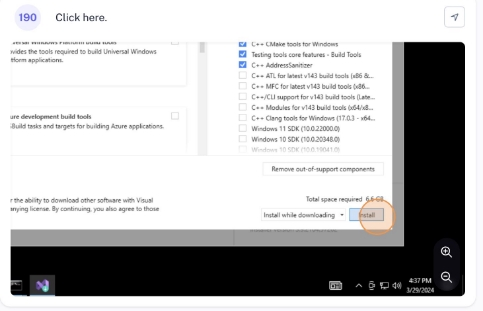
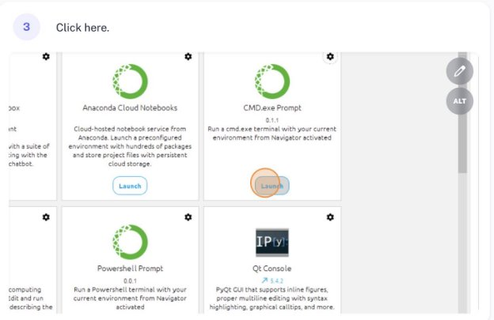

# Solar-Simulator-Software

Based on https://github.com/JerWer/Solar-Simulator-Software/

Python-based solar simulator software

This is a solar simulator software that connects to a keithley 2400 sourcemeter and Keithley 2600 sourcemeters. 
It allows to make various types of voltage and current scans and sequences of measurements, typically used for perovskite solar cell research. 
It features also an internal database where all the measurements are saved automatically, and can be accessed easily from the gui. 

using: Python 3.8.3, sqlite 3.32.3, PyQt5

Download [https://www.microsoft.com/en-sg/download/details.aspx?id=48145 ](https://www.microsoft.com/en-sg/download/details.aspx?id=48145)Download <https://visualstudio.microsoft.com/visual-cpp-build-tools>

After install visual cpp build tools click this

Install Anaconda from[ https://www.anaconda.com/download ](https://www.anaconda.com/download)In anaconda Install Anaconda Toolbox

Navigate to the folder containing Solar Simulator by typing cd and drag the folder into the prompt that opened.

Run pip3 install getmac then pip3 install pyserial then pip3 install pyvisa

then pip3 install xlsxwriter Next run python main.py

